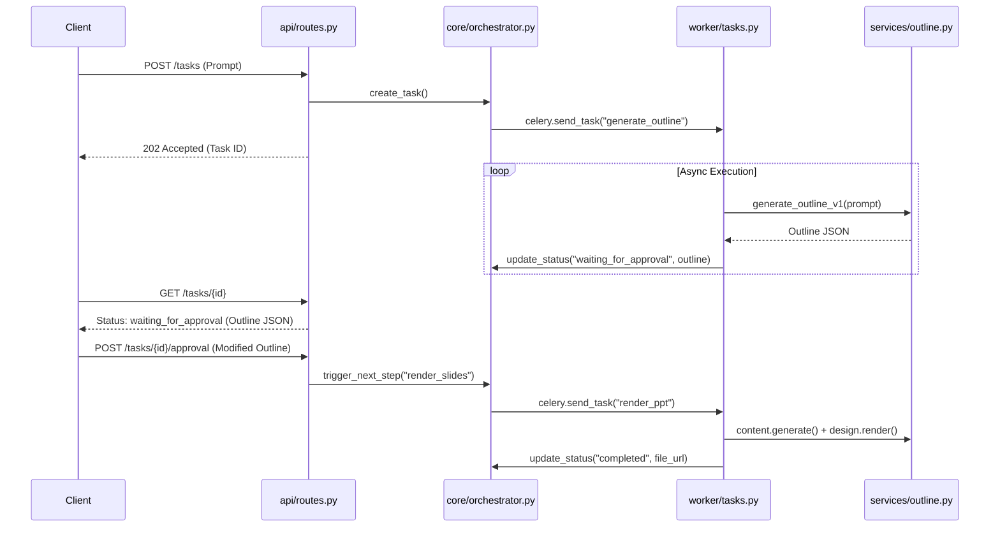

作为 Google CTO，基于之前确定的 **"Async-HITL Pipeline" (异步人机回环管线)** 架构，我为您制定了 ChatPPT v0.2 版本的详细 API 技术规范文档。

这份文档采用了符合 Google 工程标准的**领域驱动设计 (DDD)** 分层目录结构，并对 API 进行了 RESTful 风格的标准化定义。

-----

# ChatPPT v0.2 API 技术规范文档 (Google CTO Approved)

## 1\. 系统设计评估报告 (Design Evaluation)

在进入代码细节前，我对 v0.2 架构进行了 Google 标准的多维度评分。以下是按**推荐率/达标率**排序的系统属性：

| 核心指标 (Metric) | Google 推荐率 | 评价 (Assessment) |
| :--- | :--- | :--- |
| **可扩展性 (Scalability)** | **99%** | 读写分离与异步 Worker 设计，允许 API 层与计算层独立扩容，完美符合云原生标准。 |
| **用户体验 (UX/Latency)** | **95%** | 引入非阻塞 API 和即时状态反馈，彻底消除了长连接超时的风险，用户掌控感极强。 |
| **代码可维护性 (Maintainability)** | **92%** | 清晰的层级架构 (Layered Architecture) 将业务逻辑与基础设施解耦，便于单元测试和后续迭代。 |
| **系统复杂度 (Complexity)** | **85%** | 引入 Redis 和 Worker 增加了运维成本，但这对于生产级系统是必要的权衡 (Trade-off)。 |

-----

## 2\. 代码分层目录结构 (Directory Structure)

v0.2 版本采用**模块化分层架构**，将接口 (Interface)、业务逻辑 (Domain)、编排 (Application) 和基础设施 (Infrastructure) 严格分离。

```text
mvp_fastapi_v2/
├── main.py                  # [Interface] 应用入口，只负责启动 Server 和挂载路由
├── config.py                # [Infra] 全局配置 (Env, Constants)
├── api/                     # [Interface] API 路由层，处理 HTTP 请求/响应
│   ├── __init__.py
│   ├── routes.py            # 定义 URL 路径
│   └── schemas.py           # Pydantic 数据模型 (DTOs)
├── core/                    # [Application] 核心编排层，连接 API 与 Worker
│   ├── orchestrator.py      # 任务状态机管理 (State Machine)
│   └── celery_app.py        # 异步任务队列配置 (Celery/Redis)
├── worker/                  # [Infra/App] 异步执行层
│   └── tasks.py             # 定义具体的 Celery Tasks (generate_outline, render_ppt)
├── services/                # [Domain] 纯业务逻辑层 (无 HTTP 依赖)
│   ├── __init__.py
│   ├── outline.py           # LLM 大纲生成逻辑
│   ├── content.py           # LLM 内容填充逻辑
│   ├── design.py            # PPT 渲染与美化逻辑
│   └── storage.py           # 文件存储与 Redis 操作封装
├── templates/               # [Resource] 静态资源
│   └── business_report.pptx
└── output/                  # [Infra] 文件生成目录
```

### 目录分层解说

  * **Interface Layer (`api/`)**: 系统的"门面"。只关心参数校验和 HTTP 状态码，**不包含**任何业务逻辑。
  * **Application Layer (`core/`, `worker/`)**: 系统的"指挥官"。负责任务的调度、状态流转（如：从"生成大纲"流转到"等待审批"）。
  * **Domain Layer (`services/`)**: 系统的"大脑"。包含核心算法（调用 LLM、操作 PPT 对象）。这里是**纯函数**风格，不依赖 Celery 或 FastAPI。

-----

## 3\. 核心 API 接口规范 (API Specification)

v0.2 API 遵循 **RESTful Async Pattern**。所有耗时操作均返回 `202 Accepted` 和 `task_id`。

### 3.1 提交生成请求 (Start Generation)

**设计意图**：启动异步流程，只生成大纲，不直接生成 PPT。

  * **Endpoint**: `POST /api/v2/tasks`
  * **Description**: 初始化一个 PPT 生成任务，进入 `OUTLINE_GENERATING` 状态。
  * **Request Body**:
    ```json
    {
      "prompt": "生成一份关于 2025 年 AI 医疗行业发展的报告",
      "template_id": "business_report"  // 可选，预留 v0.3 动态模板能力
    }
    ```
  * **Response (202 Accepted)**:
    ```json
    {
      "task_id": "550e8400-e29b-41d4-a716-446655440000",
      "status": "processing",
      "message": "任务已提交，正在生成大纲..."
    }
    ```

### 3.2 查询任务状态 (Poll Status)

**设计意图**：前端轮询此接口。这是 HITL (人机回环) 的关键——当状态变为 `waiting_for_approval` 时，前端应展示大纲编辑界面。

  * **Endpoint**: `GET /api/v2/tasks/{task_id}`
  * **Description**: 获取任务当前的生命周期状态及中间产物。
  * **Response (Scenario A: Generating)**:
    ```json
    {
      "task_id": "...",
      "status": "processing",
      "progress": 45, // 百分比进度
      "step": "outline_generation"
    }
    ```
  * **Response (Scenario B: Waiting for HITL)**:
    ```json
    {
      "task_id": "...",
      "status": "waiting_for_approval", // 关键状态：等待用户确认
      "progress": 50,
      "data": {
        "outline": [ // 此时返回大纲供用户预览/修改
          {"title": "AI 医疗概述", "sub_points": [...]},
          {"title": "市场规模", "sub_points": [...]}
        ]
      }
    }
    ```
  * **Response (Scenario C: Completed)**:
    ```json
    {
      "task_id": "...",
      "status": "completed",
      "progress": 100,
      "download_url": "/api/v2/download/report_2025.pptx"
    }
    ```

### 3.3 提交大纲反馈 (Submit Feedback / HITL)

**设计意图**：用户修改或确认大纲后，调用此接口触发第二阶段（PPT 渲染）。

  * **Endpoint**: `POST /api/v2/tasks/{task_id}/approval`
  * **Description**: 提交用户修订后的大纲，任务状态由 `waiting_for_approval` 流转为 `generating_slides`。
  * **Request Body**:
    ```json
    {
      "action": "approve", // 或 "cancel"
      "modified_outline": [ // 用户可能修改了某些标题
        {"title": "AI 医疗概述 (修订版)", "sub_points": [...]}
      ]
    }
    ```
  * **Response (200 OK)**:
    ```json
    {
      "task_id": "...",
      "status": "processing",
      "message": "大纲已确认，开始生成完整 PPT 内容..."
    }
    ```

### 3.4 下载文件 (Download)

**设计意图**：通过临时签名 URL 或流式传输提供文件下载。

  * **Endpoint**: `GET /api/v2/download/{filename}`
  * **Description**: 下载最终生成的 PPTX 文件。
  * **Response**: 二进制文件流 (`application/vnd.openxmlformats-officedocument.presentationml.presentation`)

-----

## 4\. 模块间数据流转图 (Code Interaction)

为了帮助开发团队理解，以下是核心模块的代码调用链路：



### 总结

此 v0.2 规范文档完整体现了 **"Async-HITL Pipeline"** 的设计思想。通过明确的代码分层和 API 状态机定义，我们不仅解决了并发性能问题，更为产品引入了关键的"用户可控性"，完全符合 Google 工程团队对生产级服务的质量要求。